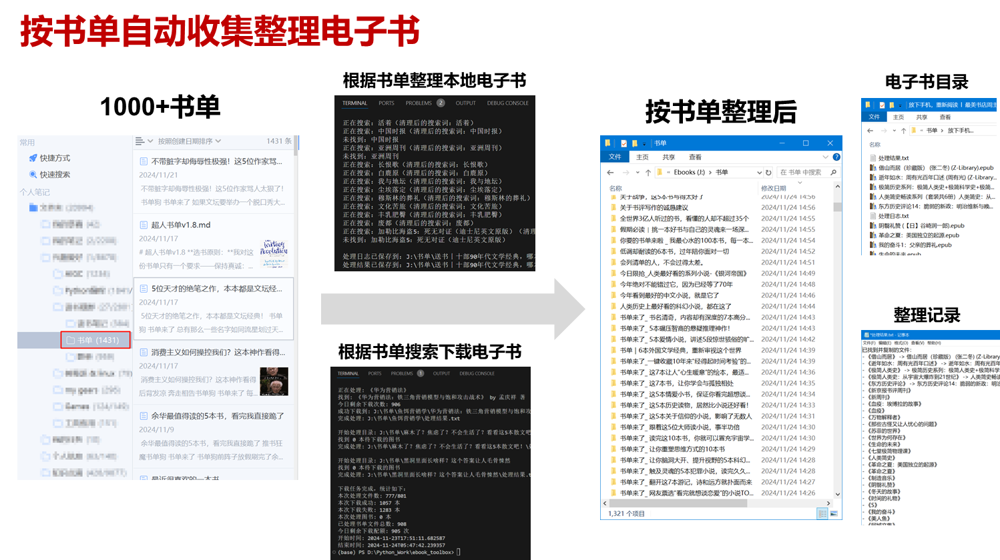

# ebook_toolbox 电子书处理工具箱

## 工具列表

主要工具：

1. `collect_local_ebooks.py`: 本地电子书搜索与整理工具
2. `download_ebooks_from_zlibrary.py`: Z-Library电子书下载工具

辅助工具：

1. `rename_epub_with_catalog.py`: EPUB合集文件名处理工具
2. `clean_booknames.py`: 书名清理工具
3. `pull_md_images_to_local.py`: Markdown文档图片本地化工具
4. `doc2md.py`: Word文档转Markdown工具

书单合集：

1000+书单合集_famotime.rar：本压缩包包含了我多年积攒的1000+书单，不知道读什么时可以按单索书。也可以从这个书单开始构建你的电子书库。

## 主要工具说明



### 电子书搜索与整理 (collect_local_ebooks.py)

根据书单内容在本地硬盘上查找指定的电子书文件，并将它们复制到到对应书单目录中。

- 支持从剪贴板或文本文件读取书名清单（使用《》标记的书名）

- 按文件类型优先级搜索：epub > pdf > txt

注意事项：

- 首次运行会生成本地硬盘文件索引，耗时较长，请耐心等待
- 书名清单需要使用《》标记；使用剪贴板模式时，检测到不含《》的文本会终止运行；
- 搜索时会忽略文件名中的标点符号和大小写
- 文件名匹配规则：必须以搜索词开头
- 同一本书存在多个版本时，优先选择更大的文件


### Z-Library电子书下载 (download_ebooks_from_zlibrary.py)

从Z-Library自动批量下载电子书。

- 自动处理登录和搜索过程
- 自动读取书单目录中的缺失文件，批量下载电子书
- 自动重试和错误处理
- 生成下载报告和日志

注意下载前须在`../account/web_accounts.json`（account是本代码文件夹的同级目录）中配置Zlibrary帐号信息：

```json
{
    "zlibrary": {"email": "your_email@example.com", "password": "your_password"}
}
```

代码库中附带了一个示例目录和文件，你需要把它拷贝到父目录，并在web_account.json中修改你的账号信息。当然，你也可以不用这么麻烦，直接把账号密码信息写在源代码里。

Z-Library的普通账号每天下载配额是10本书，如果不够用，可以考虑购买VIP账号。

## 辅助工具说明

**EPUB合集文件名补充内容信息 (rename_epub_with_catalog.py)**

这个脚本用于处理EPUB电子书合集的文件名，自动添加合集内容（一级目录）信息。

- 自动处理文件名中包含"全集"、"套装"、"作品集"等关键词的文件
- 读取EPUB文件的一级目录信息，添加到文件名中（格式：原文件名 [目录信息].epub）

使用示例：
   ```bash
   # 原文件名
   鲁迅全集(Z-Library).epub

   # 处理后的文件名
   鲁迅全集 [朝花夕拾_野草_故事新编_华盖集].epub

   # 如果目录过长，会截断
   鲁迅全集 [朝花夕拾_野草...].epub
   ```

**书名清理工具 (clean_booknames.py)**

用于清理和标准化书名格式。

**Markdown图片本地化工具 (pull_md_images_to_local.py)**

用于处理Markdown文档中的远程图片链接，将图片下载到本地并更新链接。

**Word转Markdown工具 (doc2md.py)**

用于将Word文档(.doc/.docx)转换/合并为Markdown文档。


## 依赖库

- pyperclip：用于剪贴板操作
- requests：用于发送HTTP请求和下载文件
- ebooklib：用于读取EPUB电子书
- Zlibrary.py：Z-Library API封装库
- docx2txt：用于提取Word文档内容

