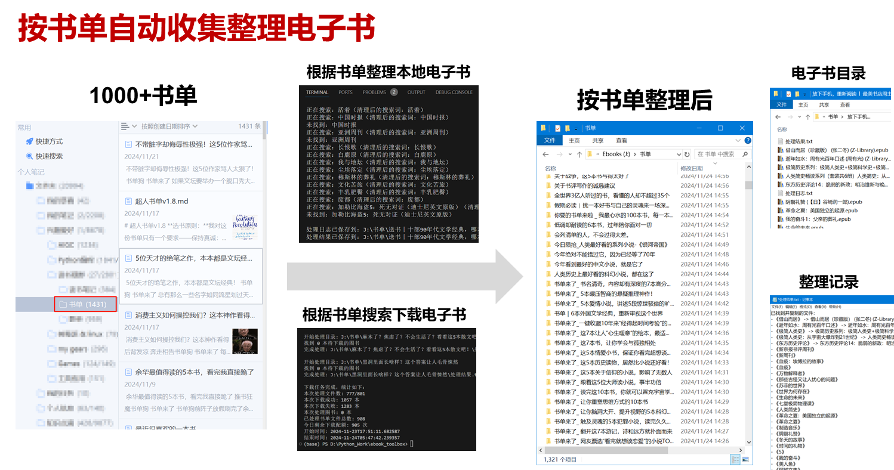
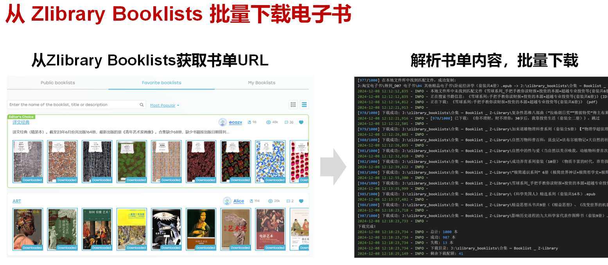

# ebook_toolbox 电子书处理工具箱

面向个人电子书库整理的脚本集合，覆盖本地书单检索、Z-Library 补全下载、书单页抓取、重复文件报告和若干独立清理工具。

## 快速开始

1. 安装依赖：

   ```bash
   pip install requests pyperclip selenium lxml docx2txt ebooklib send2trash pywin32
   ```

2. 复制项目根目录下的 `.env.example` 为 `.env`，填写 Z-Library 账号信息：

   ```dotenv
   ZLIBRARY_EMAIL=your_email@example.com
   ZLIBRARY_PASSWORD=your_password

   # 或者直接使用 remix token
   ZLIBRARY_REMIX_USERID=
   ZLIBRARY_REMIX_USERKEY=
   ```

3. 按需运行脚本，并通过命令行参数覆盖默认路径。

4. 跑测试验证当前改动：

   ```bash
   python -m unittest discover -s tests
   ```

## 主要能力



### 本地电子书搜索与整理 (collect_local_ebooks.py)

- `collect_local_ebooks.py`：从文本文件或剪贴板提取《书名》清单，搜索本地电子书库并生成 `处理结果.txt` / `处理日志.txt`

- 根据书单内容在本地硬盘上查找指定的电子书文件，并将它们复制到到对应书单目录中。
  - 支持从剪贴板或文本文件读取书名清单（使用《》标记的书名）
  - 按文件类型优先级搜索：epub > pdf > txt > mobi > azw3
  - 使用统一的 SQLite 文件索引 `_file_index.sqlite3`
- 注意事项：
  - 首次运行会生成本地硬盘文件索引，耗时较长，请耐心等待
  - 书名清单需要使用《》标记；使用剪贴板模式时，检测到不含《》的文本会终止运行；
  - 搜索时会忽略文件名中的标点符号和大小写
  - 文件名匹配规则：标准化后必须以搜索词开头
  - 同一本书存在多个版本时，优先选择更高格式优先级、再选更大的文件
  - 复制前会检查输出目录中是否已经存在相同内容的文件，避免同内容重复拷贝

### Z-Library电子书下载 (download_ebooks_from_zlibrary.py)

自动读取书单目录中的缺失的电子书，从Z-Library自动搜索并批量下载。

- `download_ebooks_from_zlibrary.py`：读取书单目录下的 `处理结果.txt`，对“未找到的文件”，从Z-Library自动搜索并批量下载。

  Z-Library的普通账号每天下载配额是10本书，如果不够用，可以考虑购买VIP账号。

- `download_from_zlibrary_booklist.py`：解析 Z-Library 书单页面并批量下载

  

  根据 Z-Library Booklists 中相关书单网址，自动解析书单页面包含的电子书并批量下载。

  - 复制一个或多个 Z-Library 书单页面URL到剪贴板
  - 通过URL访问书单Web页面，解析其中的电子书信息，并逐个下载电子书
  - 自动处理登录和电子书搜索匹配
  - 下载前搜索统一 SQLite 本地索引，先按精确标题命中，再按标准化标题前缀匹配，只下载本地没有的书

### 根据本地书单文件批量下载电子书工具（collect_ebooks_with_booklists.py）

- `collect_ebooks_with_booklists.py`：先本地搜索，再对缺失项调用 Z-Library 下载

整合了上述两个脚本的操作，首先根据本地书单文件在本地硬盘上搜索电子书，然后从Z-Library下载未找到的电子书。


### 重复文件处理

- `find_duplicated_files.py`：建立索引、识别重复文件、导出 Markdown 报告
- `remove_duplicates_on_report.py`：按报告中的 `- [x]` 项把文件移入回收站

- 重复文件判断规则：
  - 业务层“同一本书”使用标准化书名加扩展名匹配
  - 物理层“同一个文件”使用 `size -> quick hash -> full hash` 分层判定
  - 专门的重复文件检测可以识别“文件名不同但内容相同”的重复文件

### 独立小工具

- `clean_booknames.py`：清理电子书文件名中的 `(Z-Library)`、编号尾缀等冗余信息

- `rename_epub_with_catalog.py`：为 EPUB 合集文件名补充一级目录信息

  这个脚本用于处理EPUB电子书合集的文件名，自动添加合集内容（一级目录）信息。

  - 自动处理文件名中包含"全集"、"套装"、"作品集"等关键词的文件
  - 读取EPUB文件的一级目录信息，添加到文件名中（格式：原文件名 [目录信息].epub）

  使用示例：

  ```
  原文件名
     鲁迅全集(Z-Library).epub
  处理后的文件名
     鲁迅全集 [朝花夕拾\_野草\_故事新编\_华盖集].epub
  如果目录过长，会截断
     鲁迅全集 [朝花夕拾\_野草...].epub
  ```

- `pull_md_images_to_local.py`：将 Markdown 中的远程图片下载到本地并改写链接

- `doc2md.py`：将目录中的 `.doc/.docx` 合并为单个 Markdown

## 示例命令

```bash
python collect_ebooks_with_booklists.py
python download_ebooks_from_zlibrary.py
python download_from_zlibrary_booklist.py
python clean_booknames.py --directory "J:\电子书\2024年"
python pull_md_images_to_local.py --md-file "D:\notes\article.md"
python doc2md.py --input-dir "G:\Download\创作"
python rename_epub_with_catalog.py --target-dir "J:\zlibrary" "K:\ebooks"
```

## 书单素材

`1000+书单合集_famotime.rar` 本压缩包包含了我多年积攒的1000+书单，不知道读什么时可以按单索书。也可以从这个书单开始构建你的电子书库。
